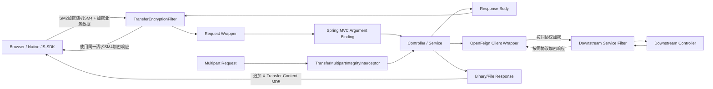
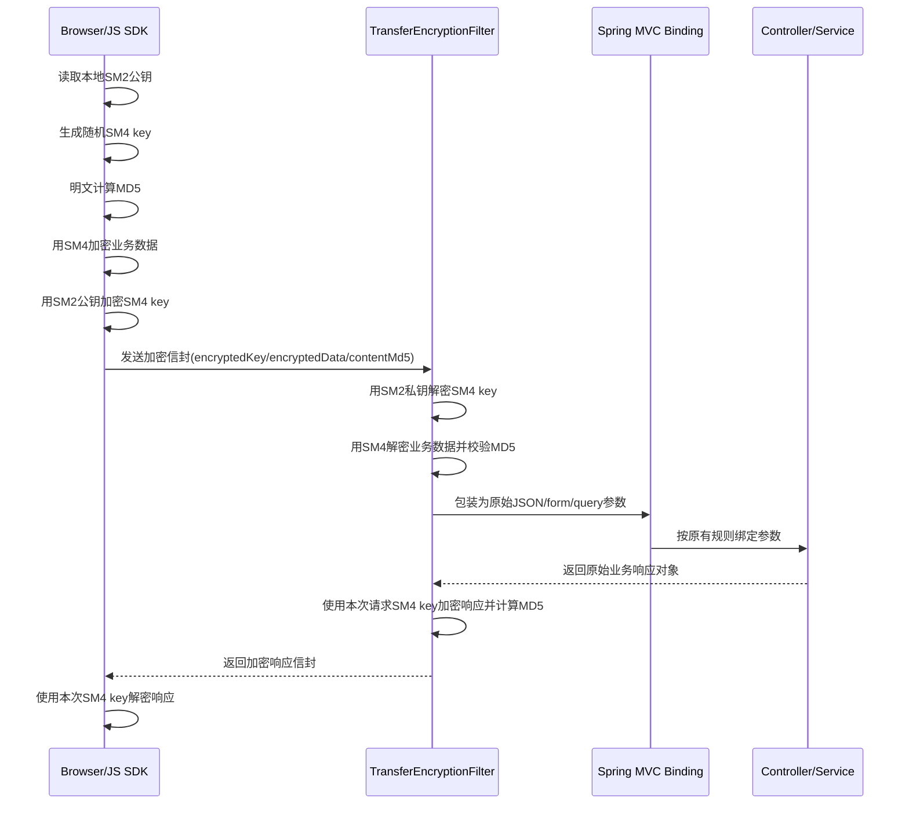
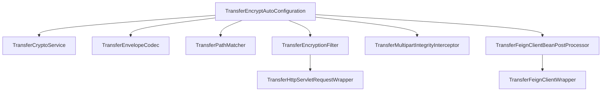
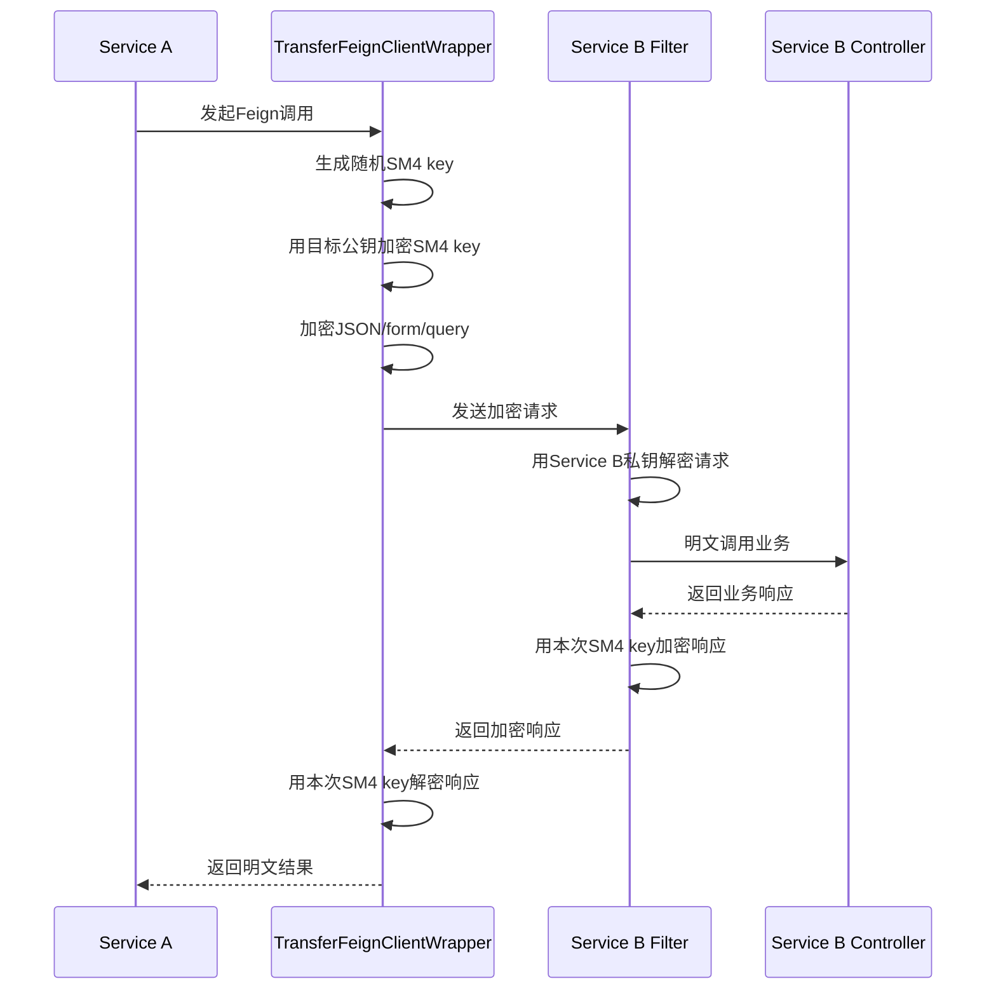
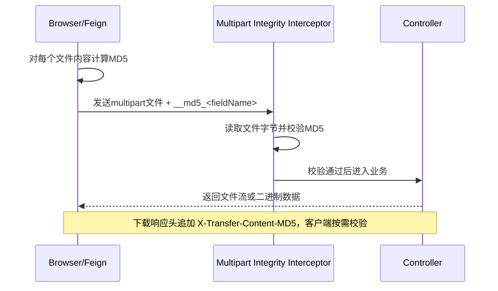

# 传输层加密架构设计

本文描述当前项目的通用传输层加密架构，包括浏览器前端、Spring Web MVC 服务端、OpenFeign 服务间调用，以及文件完整性校验链路。

## 1. 设计目标

- 不侵入业务 Controller。
- 保持 Spring MVC 原有参数绑定能力。
- 支持 `GET`、`POST`、`PUT`、`DELETE`。
- 支持 `@RequestBody`、`@ResponseBody`、表单、`query param`。
- 文件上传/下载默认不加密，只做 `MD5` 完整性校验。
- 支持前端和 OpenFeign 使用同一套协议。
- 支持内网离线部署，不依赖外网静态资源。

## 2. 总体组件图



## 3. 连接建立方式

这里的“连接建立”不是额外创建一条长连接，也不是做 TLS 替代，而是一次请求内的“应用层短时密钥协商”。

### 3.1 基本原则

- 服务端长期持有 `SM2 privateKey`。
- 客户端只持有服务端 `SM2 publicKey`。
- 每个请求临时生成一个随机 `SM4 key`。
- 这个 `SM4 key` 只用于“本次请求 + 本次响应”。
- 响应返回后，前后端都应丢弃该 `SM4 key`。

### 3.2 建链步骤

1. 前端或 Feign 调用方通过“构建注入、配置中心、内网静态配置、页面模板渲染”等方式拿到服务端 `SM2 publicKey`。
2. 调用发起前，客户端本地生成 16 位随机 `SM4 key`。
3. 明文业务数据先计算 `MD5`，再用 `SM4 key` 加密。
4. `SM4 key` 再用服务端 `SM2 publicKey` 加密。
5. 服务端收到请求后，用 `SM2 privateKey` 解出 `SM4 key`，再解密业务数据。
6. 服务端执行业务逻辑后，复用同一个 `SM4 key` 加密响应体。
7. 客户端拿到响应后，用本次请求保存的 `SM4 key` 解密响应。

## 4. 浏览器前端时序



### 4.1 JSON 请求

- 浏览器请求体直接发送 JSON 信封。
- 服务端 `Filter` 解密后重新包装请求体。
- 后续仍然由 `HttpMessageConverter` 完成 `@RequestBody` 绑定。

### 4.2 表单请求

- 浏览器把加密后的表单明文转成 `encryptedKey/encryptedData/contentMd5` 三个表单字段。
- 服务端解密后重新构造参数表。
- 后续 `@RequestParam` / `@ModelAttribute` 仍按原来方式绑定。

### 4.3 Query 参数

- `GET/DELETE` 请求把原始 query 串整体加密。
- 服务端解密后重新生成 `parameterMap` 和 `queryString`。
- 后续控制器读取到的仍是明文参数。

## 5. 服务端内部结构



### 5.1 请求入口

- `TransferPathMatcher` 负责按正则决定哪些路径启用加密。
- `TransferEncryptionFilter` 负责请求解密、响应加密、二进制响应 MD5。
- `TransferMultipartIntegrityInterceptor` 负责 `multipart/form-data` 文件 MD5 校验。

### 5.2 不侵入绑定的关键点

- JSON：替换 `ServletInputStream`，让 Spring 继续走标准消息转换器。
- Form / Query：重建 `parameterMap`、`getParameter()`、`getQueryString()`。
- Controller 无需感知加解密过程。

## 6. OpenFeign 时序



### 6.1 当前版本的 Feign 公钥假设

只有标注了 `@TransferEncryptedFeignClient` 的 Feign 接口调用才会打开加密上下文。

如果注解声明了 `publicKeyAlias`，则优先按该别名选取下游公钥。
方法上声明的 `publicKeyAlias` 会覆盖接口上的同名配置。
如果注解声明了 `md5Enabled`，则可控制是否启用额外的 `X-Transfer-Content-MD5` 头。

未标注的 Feign 接口：

- 仍然使用 Spring Cloud OpenFeign 默认代理。
- 仍然走自动注入。
- 不会触发请求加密和响应解密。

当前代码支持三层选择模式：

- 注解 `@TransferEncryptedFeignClient(publicKeyAlias = "...")` 指定别名公钥。
- 默认使用全局 `transfer.encrypt.public-key` 作为下游服务公钥。
- 若配置 `transfer.encrypt.feign-public-keys.<serviceId或host>`，则优先按目标 `host/serviceId` 选择下游公钥。

`md5Enabled` 说明：

- `true`：对 plain/binary/multipart 请求与响应启用额外 MD5 头处理
- `false`：跳过额外 MD5 头
- 不影响加密信封内部的 `contentMd5`

示例：

```yaml
transfer:
  encrypt:
    public-key: 默认下游公钥
    feign-public-keys:
      service-b: service-b 的 SM2 公钥
      order-service.internal: order-service 的 SM2 公钥
```

## 7. 文件上传/下载时序



### 7.1 为什么文件不默认加密

- 文件往往体积大，二次包裹会显著增加 CPU 和内存开销。
- 浏览器和服务端对流式二进制的处理链路更复杂。
- 对多数内网文件传输场景，完整性校验已经能满足“文件未损坏、未被篡改”的要求。

## 8. 前端离线部署结构

推荐静态资源目录：

```text
static/
├─ vendor/
│  ├─ sm-crypto.min.js
│  └─ LICENCE_MIT.sm-crypto
├─ transfer-encrypt.js
└─ app.js
```

页面引用：

```html
<script src="/static/vendor/sm-crypto.min.js"></script>
<script src="/static/transfer-encrypt.js"></script>
<script>
  TransferEncryptRegisterSmCrypto(window.smCrypto);
</script>
```

## 9. 安全边界与建议

- 本方案是应用层传输加密，不替代 HTTPS / mTLS。
- `SM2 publicKey` 分发应通过内网配置、构建注入或可信页面模板完成。
- 服务端私钥只能保存在服务端。
- 建议对时间戳、重放保护、签名、防串改字段白名单继续增强。
- `MD5` 只用于完整性快速校验，不应用作高强度抗碰撞安全签名。

## 10. 当前实现文件

- 核心自动配置：
  [TransferEncryptAutoConfiguration.java](E:\IdeaProject\generic-transfer-encrypt\spring2-plugin\src\main\java\io\github\jasper\transfer\encrypt\autoconfigure\TransferEncryptAutoConfiguration.java)
- 请求/响应过滤器：
  [TransferEncryptionFilter.java](E:\IdeaProject\generic-transfer-encrypt\spring2-plugin\src\main\java\io\github\jasper\transfer\encrypt\web\TransferEncryptionFilter.java)
- Feign 包装：
  [TransferFeignClientWrapper.java](E:\IdeaProject\generic-transfer-encrypt\spring2-plugin\src\main\java\io\github\jasper\transfer\encrypt\feign\TransferFeignClientWrapper.java)
- 前端 SDK：
  [transfer-encrypt.js](.\example\transfer-encrypt.js)
- 本地离线第三方库：
  [sm-crypto.min.js](.\example\vendor\sm-crypto.min.js)
